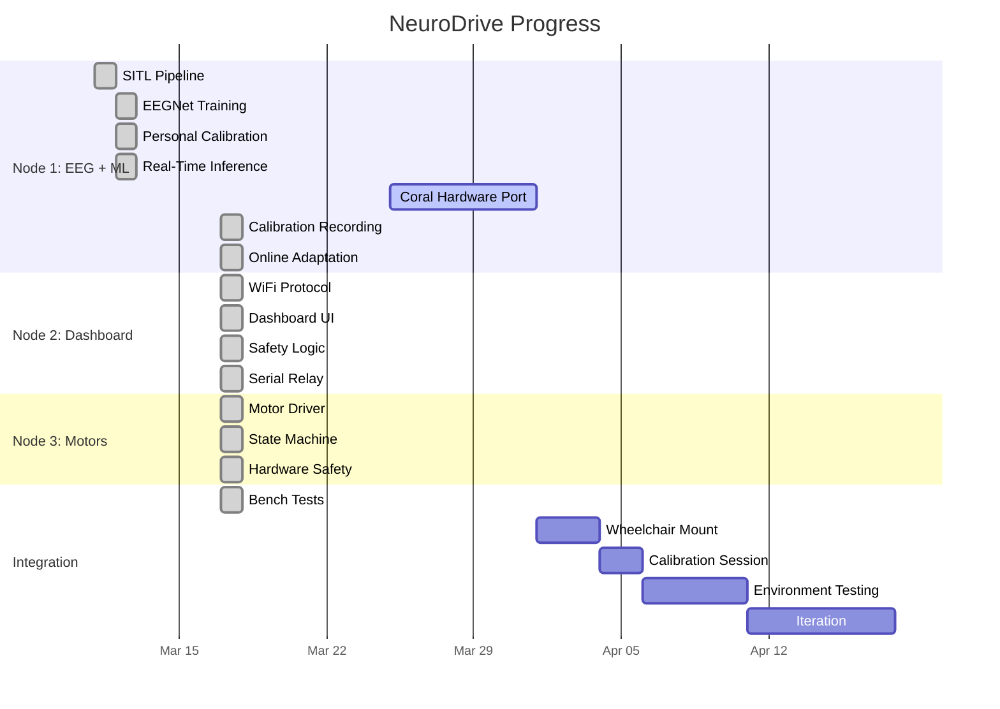

<p align="center">
  
  
  
  
</p>

# NeuroDrive

3-node Brain-Computer Interface system. Reads motor imagery EEG, classifies it with EEGNet on a Coral Edge TPU, and drives a wheelchair. No joystick needed.

---

## Architecture

```mermaid
graph LR
    subgraph NODE1["Node 1: Coral Dev Board Mini"]
        A[ADS1299 8ch EEG] --> B[DSP Filtering]
        B --> C[EEGNet Inference]
        C --> D[Command Output]
    end

    subgraph NODE2["Node 2: Raspberry Pi 5"]
        E[Dashboard UI] --> F[Safety Logic]
        F --> G[Serial Relay]
    end

    subgraph NODE3["Node 3: Arduino Mega 2560"]
        H[State Machine] --> I[PWM Motor Control]
        I --> J[H-Bridge Motors]
    end

    D -->|WiFi UDP:5000| E
    G -->|Serial UART| H

    style NODE1 fill:#1a1a2e,stroke:#e94560,color:#fff
    style NODE2 fill:#1a1a2e,stroke:#0f3460,color:#fff
    style NODE3 fill:#1a1a2e,stroke:#16c79a,color:#fff
```



| Node | Hardware | Role | Specs |
|:----:|:--------:|:-----|:------|
| **1** | Coral Dev Board Mini | EEG acquisition + ML inference | 8ch 24-bit ADC, Edge TPU, ~4ms inference |
| **2** | Raspberry Pi 5 | Dashboard + safety relay | NiceGUI web UI, heartbeat timeout, E-stop |
| **3** | Arduino Mega 2560 | Motor control | 6-state FSM, PWM ramp, hardware E-stop ISR |

---

## Motor Imagery Mapping

| Imagery | Command | Action | EEG Source |
|:-------:|:-------:|:------:|:----------:|
| Right hand | `L` | Steer left | C4 ERD (contralateral) |
| Left hand | `R` | Steer right | C3 ERD (contralateral) |
| Feet | `F` | Forward | Cz ERD (medial cortex) |
| Tongue | `S` | Stop | Broad cortical pattern |

---

## Signal Pipeline

```
ADS1299 (250 SPS, 8ch) --> 50Hz Notch (IIR, Q=30) --> 8-30Hz Bandpass (Butterworth, order 4)
    --> 1s sliding window --> EEGNet (1,684 params) --> Confidence gate (40%)
    --> Majority vote (window=3) --> UDP command --> Safety checks --> Motor PWM
```

---

## Safety

Three independent layers -- any one of them can stop the wheelchair:

| Layer | Where | What |
|:-----:|:-----:|:-----|
| Software | Node 1 + 2 | Confidence threshold, vote smoothing, heartbeat timeout (3s), speed limiter |
| Firmware | Node 3 | Serial watchdog (2s), battery cutoff (10.5V), PWM ramp limiting, state validation |
| Hardware | Electrical | Physical E-stop button wired to motor driver enable -- bypasses all software |

---

## Performance

| Metric | Value |
|:-------|------:|
| Sampling rate | 250 SPS x 8ch |
| Inference latency | ~4 ms (GPU) / ~2-5 ms (Edge TPU) |
| End-to-end latency | < 10 ms |
| Cross-subject accuracy | 43% (chance = 25%) |
| After calibration | 56% SITL (target 75-85% real) |
| Inference headroom | 492 ms / 500 ms budget |
| Bench tests | 5/5 passing |

---

## Project Structure

```
NeuroDrive/
├── node1_sitl_pipeline.py       # SITL EEG replay + DSP filtering
├── node1_training.py            # EEGNet pre-training (PyTorch + CUDA)
├── node1_calibrate.py           # Personal fine-tuning with BN freeze
├── node1_inference.py           # Real-time SITL inference
├── node1_coral.py               # Production: ADS1299 + TFLite + calibration + adaptation
├── node2_dashboard.py           # Dashboard + safety + serial relay
├── node3_motor_control/
│   └── node3_motor_control.ino  # Arduino state machine + ramp + E-stop
├── bench_test.py                # Automated test suite (5 tests)
├── models/                      # Trained .pt and .onnx files
├── calibration_data/            # Personal EEG recordings (.npz)
└── logs/                        # Runtime logs (gitignored)
```

---

## Quick Start

```bash
git clone https://github.com/Bumply/bitirme.git NeuroDrive
cd NeuroDrive

# Dependencies (dev PC with NVIDIA GPU)
pip install torch torchvision --index-url https://download.pytorch.org/whl/cu121
pip install moabb mne numpy scipy scikit-learn matplotlib onnx
pip install nicegui pyserial
pip install tensorflow-cpu  # TFLite export only

# Run in order
python node1_sitl_pipeline.py    # 1. Test DSP with replayed EEG
python node1_training.py         # 2. Train EEGNet (needs GPU)
python node1_calibrate.py        # 3. Fine-tune on subject 9
python node1_inference.py        # 4. Real-time SITL inference
python node2_dashboard.py        # 5. Dashboard at localhost:8080
python bench_test.py             # 6. Run all tests
```

Arduino sketch: `node3_motor_control/node3_motor_control.ino` -- upload via Arduino IDE.

---

## Hardware BOM

<details>
<summary><b>Node 1 -- EEG + ML</b></summary>

- Google Coral Dev Board Mini (ARM + Edge TPU)
- Portiloop PCB (ADS1299 8-channel 24-bit EEG front-end)
- EEG electrode cap (FC3, FC4, C3, Cz, C4, CP3, CP4, FCz)
- Conductive gel + reference/ground electrodes

</details>

<details>
<summary><b>Node 2 -- Dashboard</b></summary>

- Raspberry Pi 5 (4GB+)
- MicroSD 32GB+
- WiFi (built-in)

</details>

<details>
<summary><b>Node 3 -- Motors</b></summary>

- Arduino Mega 2560
- L298N or BTS7960 H-bridge driver
- E-stop button (hardware kill switch)
- 12V/24V battery

</details>

---

## Roadmap



---

## Design Decisions

| Decision | Why |
|:---------|:----|
| PyTorch over TensorFlow | TF 2.11+ dropped Windows GPU support |
| EEGNet (1,684 params) | Small enough for Edge TPU int8 quantization |
| 3-node split | ML needs speed, UI needs compute, motors need reliability |
| Confidence + vote smoothing | Uncertain predictions don't move the chair |
| Hardware E-stop | Physical button bypasses all software. Non-negotiable. |
| Online adaptation | Pseudo-label fine-tuning tracks brain drift over time |

---

## Status

**Software: done.** All code written, validated against [portiloop-software](https://github.com/PortiloopTeam/portiloop-software), bench-tested 5/5.

**Next up:** Coral hardware port (needs Linux), then wheelchair integration + real EEG calibration.

---

## License

[MIT](LICENSE)
