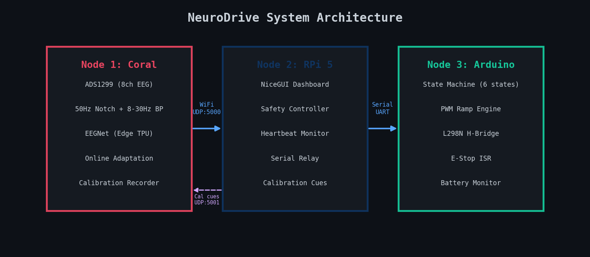

<p align="center">
  
  
  
  
</p>

# NeuroDrive

3-node Brain-Computer Interface that reads motor imagery EEG, classifies it with EEGNet on a Coral Edge TPU, and drives a wheelchair.

<p align="center">
  
</p>

<p align="center">
  <a href="https://bumply.github.io/bitirme/"><b>Full documentation, graphs, and technical details</b></a>
</p>

---

## Quick Start

```bash
git clone https://github.com/Bumply/bitirme.git NeuroDrive
cd NeuroDrive

pip install torch torchvision --index-url https://download.pytorch.org/whl/cu121
pip install moabb mne numpy scipy scikit-learn matplotlib onnx nicegui pyserial

python node1_sitl_pipeline.py    # DSP with replayed EEG
python node1_training.py         # Train EEGNet (needs GPU)
python node1_calibrate.py        # Personal fine-tuning
python node1_inference.py        # Real-time SITL inference
python node2_dashboard.py        # Dashboard at localhost:8080
python bench_test.py             # Run all tests
```

Arduino sketch: `node3_motor_control/node3_motor_control.ino`

---

## Project Structure

```
node1_sitl_pipeline.py       # SITL EEG replay + DSP filtering
node1_training.py            # EEGNet pre-training (PyTorch + CUDA)
node1_calibrate.py           # Personal fine-tuning with BN freeze
node1_inference.py           # Real-time SITL inference
node1_coral.py               # Production: ADS1299 + TFLite + calibration + adaptation
node2_dashboard.py           # Dashboard + safety + serial relay
node3_motor_control/
  node3_motor_control.ino    # Arduino state machine + ramp + E-stop
bench_test.py                # Automated test suite
models/                      # Trained .pt and .onnx files
```

---

## License

[MIT](LICENSE)
