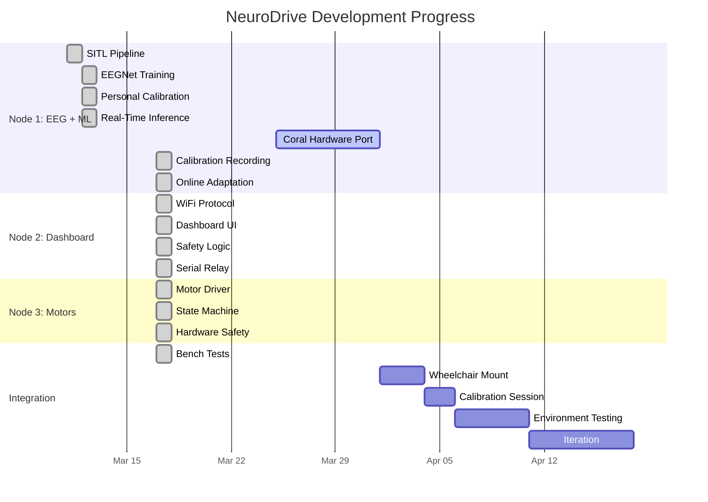

<p align="center">
  
  
  
  
</p>

<h1 align="center">NeuroDrive</h1>
<h3 align="center">Think it. Drive it.</h3>

<p align="center">
  A 3-node Brain-Computer Interface that translates <b>motor imagery EEG signals</b> into real-time wheelchair movement commands.
</p>

---

## How It Works

```
  YOUR BRAIN                    NEURODRIVE                         WHEELCHAIR
 ┌──────────┐     ┌──────────────────────────────────────────┐    ┌──────────┐
 │          │     │                                          │    │          │
 │  Imagine  │────>│  EEG Cap ──> DSP ──> EEGNet ──> Safety  │───>│  Motors  │
 │  moving   │     │  (8ch)     (filter)  (ML)     (3-layer) │    │  move!   │
 │          │     │                                          │    │          │
 └──────────┘     └──────────────────────────────────────────┘    └──────────┘
```

> Imagine moving your **right hand** and the wheelchair steers **left**.
> Imagine moving your **feet** and it drives **forward**.
> No joystick. No buttons. Just thought.

---

## Architecture

```mermaid
graph LR
    subgraph NODE1["Node 1: Coral Dev Board Mini"]
        A[ADS1299 8ch EEG] --> B[DSP Filtering]
        B --> C[EEGNet Inference]
        C --> D[Command Output]
    end

    subgraph NODE2["Node 2: Raspberry Pi 5"]
        E[Dashboard UI] --> F[Safety Logic]
        F --> G[Serial Relay]
    end

    subgraph NODE3["Node 3: Arduino Mega 2560"]
        H[State Machine] --> I[PWM Motor Control]
        I --> J[H-Bridge Motors]
    end

    D -->|WiFi UDP:5000| E
    G -->|Serial UART| H

    style NODE1 fill:#1a1a2e,stroke:#e94560,color:#fff
    style NODE2 fill:#1a1a2e,stroke:#0f3460,color:#fff
    style NODE3 fill:#1a1a2e,stroke:#16c79a,color:#fff
```

The system is split across 3 dedicated nodes, each optimized for its role:



| Node | Hardware | Role | Key Specs |
|:----:|:--------:|:-----|:----------|
| **1** | Coral Dev Board Mini | EEG + ML Inference | 8ch 24-bit ADC, Edge TPU, ~4ms inference |
| **2** | Raspberry Pi 5 | Dashboard + Safety | Web UI, 3s heartbeat timeout, E-stop relay |
| **3** | Arduino Mega 2560 | Motor Control | 6-state FSM, smooth PWM ramp, hardware E-stop ISR |

---

## Motor Imagery Commands

| Think About | Command | Wheelchair Action | Brain Region |
|:-----------:|:-------:|:-----------------:|:------------:|
| Right hand | `L` | Steer Left | C4 (right motor cortex) |
| Left hand | `R` | Steer Right | C3 (left motor cortex) |
| Feet | `F` | Drive Forward | Cz (medial motor cortex) |
| Tongue | `S` | Stop | Broad cortical pattern |

> Motor imagery activates the **opposite** hemisphere (contralateral control), which is why right hand imagery maps to left steering.

---

## Features

### Signal Processing
- 50 Hz IIR notch filter (Q=30) removes power line noise
- 8-30 Hz Butterworth bandpass (order 4) isolates mu/beta rhythms
- Per-channel stateful filtering at 250 SPS
- ERD baseline estimation with exponential moving average

### Machine Learning
- **EEGNet** architecture (Lawhern et al. 2018) -- only 1,684 parameters
- Pre-trained on BCI Competition IV-2a (8 subjects, 4-class motor imagery)
- Personal calibration: freeze early layers, fine-tune classifier (~13 min session)
- **Online adaptation**: high-confidence predictions become pseudo-labels for continuous learning
- Runs on Edge TPU via int8 quantized TFLite

### Safety (3-Layer System)

```
Layer 1: SOFTWARE          Layer 2: FIRMWARE           Layer 3: HARDWARE
 ┌─────────────────┐       ┌──────────────────┐       ┌──────────────────┐
 │ Confidence gate  │       │ Serial watchdog   │       │ Physical E-stop  │
 │ Vote smoothing   │       │ Battery cutoff    │       │ button (kills     │
 │ Heartbeat timeout│       │ PWM ramp limit    │       │ power directly)  │
 │ Speed limiter    │       │ State validation   │       │                  │
 └─────────────────┘       └──────────────────┘       └──────────────────┘
    Node 1 + 2                  Node 3                    Electrical
```

### Dashboard (Node 2)
- Dark-theme NiceGUI web app on port 8080
- **Drive tab**: live command display with glow effects, D-pad manual override, confidence bar, command log
- **Calibrate tab**: guided visual cue protocol, progress tracking, before/after accuracy display
- **Settings tab**: network, safety, serial configuration

---

## Performance

| Metric | Value |
|:-------|:------|
| Sampling rate | 250 SPS (8 channels) |
| Inference latency | ~4 ms (GPU) / ~2-5 ms (Edge TPU) |
| End-to-end latency | < 10 ms |
| Cross-subject accuracy | 43% (4-class, chance = 25%) |
| After personal calibration | 56% SITL (expected 75-85% with real data) |
| Inference budget | 500 ms window, 492 ms headroom |
| Bench tests | 5/5 passing |

---

## Project Structure

```
NeuroDrive/
├── node1_sitl_pipeline.py       # SITL EEG replay + DSP filtering
├── node1_training.py            # EEGNet pre-training (PyTorch + CUDA)
├── node1_calibrate.py           # Personal fine-tuning with BN freeze
├── node1_inference.py           # Real-time SITL inference
├── node1_coral.py               # Production: ADS1299 + TFLite + calibration + online adaptation
├── node2_dashboard.py           # Pi 5 dashboard + safety + serial relay
├── node3_motor_control/
│   └── node3_motor_control.ino  # Arduino state machine + ramp + E-stop
├── bench_test.py                # Automated test suite (5 tests)
├── models/                      # Trained .pt and .onnx model files
├── calibration_data/            # Personal EEG recordings (.npz)
└── logs/                        # Runtime logs (gitignored)
```

---

## Quick Start

```bash
# Clone
git clone https://github.com/Bumply/bitirme.git NeuroDrive
cd NeuroDrive

# Install dependencies (development PC with NVIDIA GPU)
pip install torch torchvision --index-url https://download.pytorch.org/whl/cu121
pip install moabb mne numpy scipy scikit-learn matplotlib onnx
pip install nicegui pyserial
pip install tensorflow-cpu  # TFLite export only
```

### Run the pipeline step by step:

```bash
# 1. Test DSP filtering with replayed EEG data
python node1_sitl_pipeline.py

# 2. Train EEGNet on BCI Competition IV-2a dataset
python node1_training.py

# 3. Fine-tune on personal data (SITL uses subject 9)
python node1_calibrate.py

# 4. Run real-time inference in SITL mode
python node1_inference.py

# 5. Launch the dashboard (open http://localhost:8080)
python node2_dashboard.py

# 6. Run the full bench test suite
python bench_test.py

# 7. Upload Arduino sketch via Arduino IDE
#    File: node3_motor_control/node3_motor_control.ino
```

---

## Hardware BOM

<details>
<summary><b>Node 1 -- EEG Acquisition + ML</b></summary>

- Google Coral Dev Board Mini (ARM + Edge TPU)
- Portiloop PCB (ADS1299 8-channel 24-bit EEG front-end)
- EEG electrode cap (8 channels: FC3, FC4, C3, Cz, C4, CP3, CP4, FCz)
- Conductive gel + reference/ground electrodes

</details>

<details>
<summary><b>Node 2 -- Dashboard + Relay</b></summary>

- Raspberry Pi 5 (4GB+ RAM)
- MicroSD card (32GB+)
- WiFi (built-in, connects to Coral's AP)

</details>

<details>
<summary><b>Node 3 -- Motor Control</b></summary>

- Arduino Mega 2560
- L298N or BTS7960 motor driver
- Emergency stop button (hardware kill switch)
- Power relay for motor enable/disable
- 12V/24V battery

</details>

<details>
<summary><b>Development Machine (training only)</b></summary>

- Any PC with NVIDIA GPU (RTX 3060 or better)
- Not mounted on wheelchair -- used once to train the model

</details>

---

## Roadmap



---

## Design Decisions

| Decision | Rationale |
|:---------|:----------|
| **PyTorch over TensorFlow** | TF 2.11+ dropped native Windows GPU. PyTorch CUDA works natively. |
| **EEGNet (1,684 params)** | Compact, all ops supported by Edge TPU int8 quantization. |
| **3-node separation** | Coral = real-time ML, Pi = UI/safety, Arduino = motor reliability. |
| **Confidence + vote smoothing** | Uncertain predictions never move the wheelchair. Safety first. |
| **Hardware E-stop** | Physical button bypasses all software. Non-negotiable for mobility. |
| **Online adaptation** | Pseudo-label fine-tuning tracks brain drift without recalibration. |
| **8 EEG channels** | FC3, FC4, C3, Cz, C4, CP3, CP4, FCz -- full motor cortex coverage. |

---

## Current Status

**Software: COMPLETE** -- all code written and bench-tested in SITL mode.

**Next: Hardware integration** -- Coral port (Linux), wheelchair mounting, personal calibration with real EEG.

---

<p align="center">
  <i>Built with brainwaves and late nights.</i>
</p>
